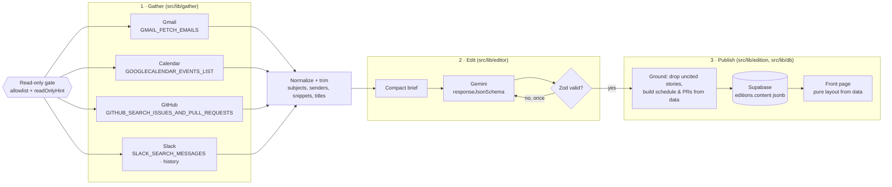

# The Morning Edition

A web app that turns your digital life into a daily newspaper. Every morning an
AI editor reads your Gmail, Google Calendar, GitHub and Slack through
[Composio](https://composio.dev), decides what actually matters, and sets it as
a classic broadsheet front page: a blackletter masthead with the date and
edition number, a lead story with a drop cap, columns of secondary stories,
**Today's Schedule**, **Pull Requests Awaiting Review**, and a weather line for
how busy the day looks. Every story links back to the email, event, PR or
message it came from.

Try `/sample` for a synthetic edition (and "Watch the press run") without any
accounts.

## How an edition is made

Generating an edition is three separate stages.



1. **Gather.** The server calls Composio read tools directly with
   `composio.tools.execute` (the model never picks tools), all four apps in
   parallel with a per-app timeout. A failed, expired, or unconnected app
   becomes a note on the page; the edition prints with what arrived.
   Normalizers turn each tool's response into small, typed items, keeping
   only subjects, senders, snippets and titles, never full bodies.
2. **Edit.** Gemini gets a compact one-line-per-item brief and returns JSON
   matching a Zod schema (passed as `responseJsonSchema`): a lead story, up to
   six secondary stories, schedule and PR annotations, and a weather line,
   each with an importance score and a one-line reason. Invalid output gets
   one retry with the validation errors fed back. HTTP 429 and 503 are
   retried with exponential backoff (honoring Google's `retryDelay`), and
   past that the reader sees a friendly "the editor is swamped" message.
3. **Publish.** Before saving, the edition is *grounded*: source ids the model
   invented are stripped, and stories left citing nothing real are dropped.
   The schedule and PR list are built from the gathered data, so the model
   can annotate a meeting but can't invent or lose one. The result is stored
   as JSON and the front page renders purely from it, so any past edition
   reprints exactly as it ran.

## The read-only guarantee

The app never sends, posts, replies, archives, edits or deletes anything in
your apps. This is enforced in code, three ways:

1. **Static allowlist.** `src/lib/composio/toolkits.ts` lists the only seven
   tools the app may execute. `executeReadTool` in
   `src/lib/composio/readonly.ts` is the single code path that runs Composio
   tools, and it refuses any slug not on that list.
2. **Runtime annotation check.** Before a tool's first use, `executeReadTool`
   fetches its definition from Composio and refuses to run it unless it
   carries Composio's `readOnlyHint` annotation. If a listed tool were ever
   re-classified as mutating, the app stops calling it. This check fails
   closed.
3. **Scopes and auth-config restrictions.** When the app creates its
   Composio auth configs, Gmail and Calendar request Google's read-only scopes
   (`gmail.readonly`, `calendar.readonly`), so those tokens can't write even
   in principle. Each config is also restricted to the allowlisted tools
   through `toolAccessConfig`. GitHub and Slack have no read-only scope that
   still covers these reads, so for those the allowlist is the guarantee.

## Multi-user connections

Each reader signs in with a Supabase magic link and gets a Composio user id
derived from their auth id (`reader_<uuid>`). The **Set up your newspaper**
page shows a card per app; **Connect** calls `connectedAccounts.link()` under
that reader's id and sends them through Composio's hosted auth. When they
return, the card flips to **Connected**. Editions are gathered only from the
signed-in reader's own connected accounts.

## Running locally

Requirements: Node 22+, and free accounts on Composio, Google AI Studio and
Supabase.

1. Install: `npm install`
2. Create a Supabase project and run `supabase/schema.sql` in its SQL editor.
   Under **Authentication → URL Configuration**, add
   `http://localhost:3000/auth/callback` to the redirect URLs.
3. Copy `.env.example` to `.env.local` and fill it in:
   - `COMPOSIO_API_KEY`: a **project** API key from the Composio dashboard
     (the CLI's user key won't work with the SDK)
   - `GEMINI_API_KEY`: from aistudio.google.com/apikey
   - `NEXT_PUBLIC_SUPABASE_URL`, `NEXT_PUBLIC_SUPABASE_ANON_KEY`,
     `SUPABASE_SERVICE_ROLE_KEY`: from Supabase **Settings → API**
   - `CRON_SECRET`: any long random string
4. `npm run dev`, open http://localhost:3000, sign in, connect apps, and press
   **Print today's edition now**.

Useful scripts:

| Command | What it does |
| --- | --- |
| `npm test` | Normalizer, schema, assembly, prompt, backoff and timezone tests |
| `npm run gather -- <composio-user-id>` | Gather only; prints normalized items per app |
| `npm run edit -- <composio-user-id>` | Gather and edit; prints the edition JSON without saving |
| `npm run typecheck` / `npm run lint` | Strict TypeScript and ESLint |

Use test accounts (a fresh Gmail, a demo Slack workspace, a GitHub repo with an
open PR requesting your review). Gemini's free tier may use prompts to improve
Google's models.

## Deploying (Vercel Hobby)

1. Import the repo in Vercel and add the same environment variables, plus
   `NEXT_PUBLIC_SITE_URL=https://<your-app>.vercel.app`.
2. Add `https://<your-app>.vercel.app/auth/callback` to Supabase's redirect
   URLs.
3. `vercel.json` registers the cron (`/api/cron`, daily at 10:00 UTC). Vercel
   sends `CRON_SECRET` as a bearer token automatically.

Everything runs on free tiers: Gemini API free tier, Composio Hobby, Supabase
Free, Vercel Hobby.

## Project layout

```
src/lib/composio/   client, read-only gate, toolkits + versions, connections
src/lib/gather/     fetchers (Composio calls) and pure normalizers per app
src/lib/editor/     Zod schema, prompt/brief, Gemini call with backoff
src/lib/edition/    assembly/grounding, stored edition type, orchestrator
src/lib/db/         Supabase queries for readers and editions
src/components/     front page, press room, setup cards
src/app/            routes: /, /sample, /login, /setup, /today, /edition/[date],
                    /archive, /settings, /api/{edition,connect,connections,cron}
```

## Limitations and next steps

- **Cron timing.** Vercel Hobby crons run once a day, so every reader's paper
  prints at 10:00 UTC (6 am in New York, mid-afternoon in Asia), dated by the
  reader's own timezone. An hourly cron (Pro) or a queue would deliver at each
  reader's local morning.
- **Slack mentions.** Mention search needs a Slack user token with
  `search:read`. Without it, the Slack section falls back to the channels
  picked in settings. Search queries for mentions (`<@U…>`) and DMs
  (`to:me`) rely on Slack's search syntax and may miss edge cases.
- **Gemini quota.** On the free tier, a burst of readers can hit rate limits.
  The cron prints one reader at a time and the UI explains any wait, but a
  paid tier or a queue would be needed beyond a handful of readers.
- **No live verification of every app here.** The normalizers were built
  against the pinned Composio tool schemas and checked on real Gmail data;
  Calendar, GitHub and Slack shapes are verified by schema and tests only.
- **Next steps:** a per-reader "editor's notes" preference (what to always
  lead with), email delivery of the edition as HTML, triggers for breaking
  news (Composio triggers) between editions, and Playwright tests for the
  front page.
